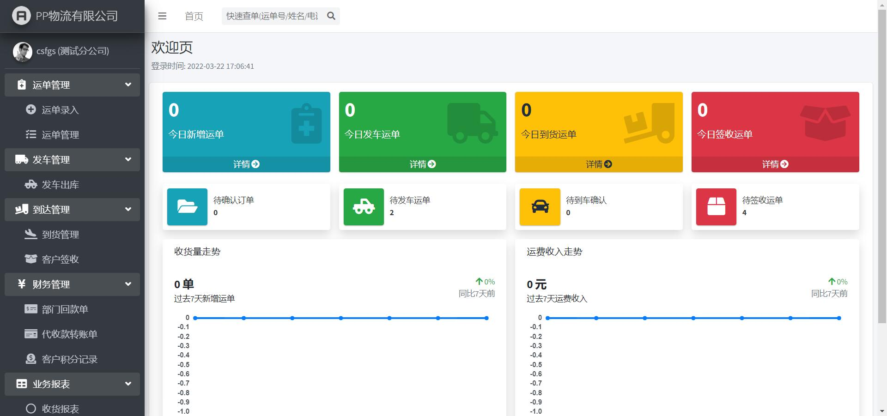
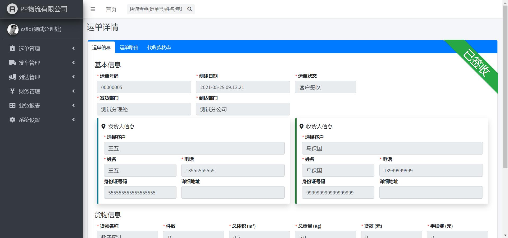
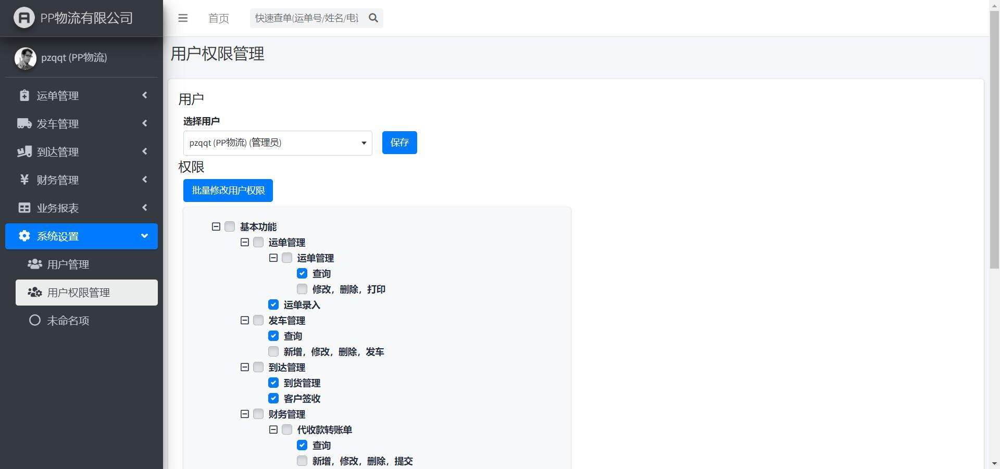

# Django_Transportation_Management_System

基于Django实现的物流管理系统（TMS，Transportation Management System）

前几年工作时忙里偷闲写的练手项目。

> 注意：如果static目录下的 AdminLTE-3.0.5 为空，那就用 static目录下的 `AdminLTE-3.0.5.zip` 解压，然后替换掉即可

## 特点

- 前端基于Bootstrap 4框架和AdminLTE框架。
- 使用MySQL作为数据库后端。
- 实现了运单录入、发车出库、到货签收、客户签收等基本功能。
- 拥有较为完善的报表功能和财务管理功能。
- 可以通过后台界面对各个用户进行权限管理。

## 缺陷

- 由于没有认清时代潮流，所以没有做前后端分离，~~本来是打算当作跳槽的敲门砖的，淦！~~。
- 由于前期纯粹是抱着练手的目的写的，边学边做，所以没有保留历史提交，~~但保留了上百个历史版本的备份~~。
- 由于知识匮乏，所以重复造了很多轮子。
- 由于没有时间~~太懒~~，所以没有编写使用文档。

## TODO

- 实现打印货物标签和提货单的功能。（需要配合打印控件）
- 实现消息功能。

## 依赖

- 要求Python最低版本：v3.9+

- 必要的第三方库
    - django
    - mysqlclient
    - openpyxl （用于实现报表导出功能）
- 可选的第三方库
    - django-debug-toolbar （用于调试）
    - django-extensions （用于增强`manage.py`的功能）

## Usage

1. pip install -r requirements.txt
2. 创建数据库，请自己根据自己的情况在mysql数据库中创建数据库，并修改 `PPWuLiu/settings.py` 文件中的 `DATABASES` 配置

```bash
DATABASES = {
    'default': {
        'ENGINE': 'django.db.backends.mysql',
        'NAME': os.getenv("DJANGO_TMS_MYSQL_DATABASE_NAME", "tms"),
        'USER': os.getenv("DJANGO_TMS_MYSQL_USER", "root"),
        'PASSWORD': os.getenv("DJANGO_TMS_MYSQL_PASSWORD", "123456"),
        'HOST': os.getenv("DJANGO_TMS_MYSQL_HOST", "127.0.0.1"),
        'PORT': os.getenv("DJANGO_TMS_MYSQL_PORT", "3306"),
    }
}
```

3. 同步数据库

注意：同步数据库前需要执行 `init_database.sh` 这个shell，如果是Windows的话，这里没办法执行，需要自己翻译这个为windows命令

现在windwos也行了，只是Windows是直接把我备份的数据库还原

Windows执行下面的命令（先进入MySQL的命令行）
```sql
create database tms;
use tms
source xxx\aa.sql  --xxx代表路径，绝对路径！！！
```

非Windows执行下面的命令
  ```bash
  python manage.py migrate
  python manage.py loaddata init_data.json
  ```

4. 启动

```bash
python manage.py runserver
```

5. Django的Admin管理后台是默认启用的，请自行创建超级用户

```bash
python manage.py createsuperuser
```

6. 如果很多静态文件不存在
```bash
cd static/AdminLTE-3.0.5
git submodule init
git submodule update
```

## 测试数据账号密码如下:

|  用户名   | 密码  | 用户类型 |
|  ----  | ----  |----|
| csshd  | 666666 | 收货点|
| csfgs  | 666666 | 分公司（到货点）|
| kj_1  | 666666 | 会计（财务部）|
| zxg_1  | 666666 | 货物装卸工1（货台）|
| zxg_2  | 666666 | 货物装卸工2（货台）|
| pzqqt  | 88888888 | 管理员|

## 预览








## 另一种部署方式，使用Docker进行部署

```shell
docker build -t tms:1.0 .
```

```shell
docker run -itd --name tms -p 8080:8080 -e DJANGO_TMS_MYSQL_DATABASE_NAME=db_name -e DJANGO_TMS_MYSQL_USER=db_user -e DJANGO_TMS_MYSQL_PASSWORD=db_pass -e DJANGO_TMS_MYSQL_HOST=db_host -e DJANGO_TMS_MYSQL_PORT=3306 tms:1.0
```